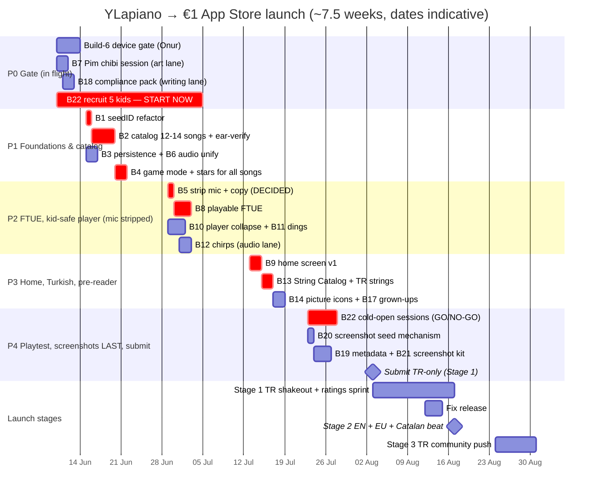

# YLapiano — Roadmap to a €1 launch (committee output, 2026-06-10)

**Source:** 13-agent committee — 9 personas (Defne, Aiko, Diego, Khalid, Mei, Marco, Luca, ASO/store, Discovery) → Reforge-growth chair synthesis → Marco effort pass → RICE scoring + Anya phasing. Full reports: `product/committee/2026-06-10-*.json`.

**One-line strategy:** at €1 nobody refunds over value — they refund and 1-star over "broken" or "prototype." Refund-prevention in the first 5 minutes IS the growth strategy. The store listing is the acquisition loop; the rating average is the growth engine. ~7 weeks, ~24 solo-dev days to submission.

> **P0 GATE PASSED — Onur tested build 6 on device 2026-06-10, feel approved.** Phase 1 unblocked.
>
> **DECIDED by Onur 2026-06-10: mic is OUT for v1.** No wiring attempt — strip the permission prompt and all "hears your piano" copy now (the committee's fallback branch). Input = USB MIDI + on-screen keys. B5 shrinks from 4 days to 0.5; revisit mic post-launch.

---

## Growth thesis (chair)

Every credible competitor (Simply Piano, Yousician, Flowkey) is a $60–170/yr English-centric subscription. The wedge: **real piano · songs in your language · €1 once · no ads · no data collected.** €0.85 net can never fund paid UA, so the only channels are App Store search, ratings compounding, and niche parenting communities (Turkish, Catalan). Win condition: 4.5+ stars at 10–15 ratings in TR week one, then EU rides the same listing.

**Activation metric:** kid's first _deliberate_ correct-key hit on the real instrument with instant audiovisual response, within 90s of device handover, zero adult words. Activated household = session 1 ends at the stars+Pim result, and next launch shows persisted stars ("it remembered").

**€5 ambition: killed for 2026.** Revisit only after ~100+ paid sales at ≥4.5 stars with reviews asking for more songs.

## Critical discoveries (verified in code)

1. **The shipping build seeds exactly ONE song** — `createSeedSongs()` returns `[plimPlim()]`; the 8 other builders are retired. A parent who pays €1 and sees one song refunds in minute one.
2. **Mic is a dead promise** — `PitchDetector.startListening()` is never called; the app requests a mic permission for a feature that doesn't function. Most refund-shaped gap in the product.
3. **Progress wipes every launch** — rungIndex is in-memory only; day 2 the app looks broken.
4. **Zero localization ships today** — the en/es .lproj files aren't in the resources build phase; TR-first launch, all-English app.
5. **Seeding deletes user songs by title match** — data-loss-on-update, the worst refund class.
6. **Mute switch kills count-in/metronome** (system sound 1104) while piano notes keep playing — game looks broken at the exact first-play moment.
7. **MascotCheer referenced at PlayerScreen.swift:592 but missing from Assets** — reduced-motion 3-star path is broken.
8. **iPad-only build (TARGETED_DEVICE_FAMILY=2)** contradicts store-config.md's iPhone 6.7" screenshot plan.

## The six rulings

| Question             | Ruling                                                                                                                                                                                                                                                                                                                                                                                                                                                                       |
| -------------------- | ---------------------------------------------------------------------------------------------------------------------------------------------------------------------------------------------------------------------------------------------------------------------------------------------------------------------------------------------------------------------------------------------------------------------------------------------------------------------------- |
| **Onboarding**       | Kill the 3 text pages. Two beats: (1) one illustrated parent page — placement diagram, mic-vs-MIDI, live "play any key" proof-of-life; (2) kid plays immediately — Pim points, 3-note tutorial through the existing song-agnostic FallingNotesScene at rung-1 forgiveness, flowing into the easiest song. The tutorial IS rung 1; no new engine.                                                                                                                             |
| **Mic**              | ~~Wire it for real with a kill criterion~~ → **OVERRULED by Onur 2026-06-10: strip now.** Remove the mic permission page, the dead `PitchDetector` path from the user flow, and ALL "hears your piano" copy (app + listing). Ship USB MIDI + on-screen keys honestly. Revisit mic as a post-launch experiment only if reviews ask for it.                                                                                                                                    |
| **Songs / bundling** | NO packs, NO IAP, NO language picker — everything in the binary (notes are ~KB). Locale-aware home sections ("Your songs" first), sorted easy→hard within. Restore the 8 builders + add 4 Turkish songs (Mini Mini Bir Kuş, Ali Babanın Çiftliği, Yağ Satarım Bal Satarım, Kırmızı Balık) → 12–14 songs, all ear-verified. Localized display titles (Twinkle = "Daha Dün Annemizin"). Every song gets game mode + stars+Pim result; the full 4-rung ladder stays Salta-only. |
| **Pim**              | Canon = CHIBI (matches the reward videos; new chibi icon is 1 still vs 3 fragile video regens). One OpenArt session: new icon + greeting/pointing/listening/cheer stills. Retire Mascot.png (the third squirrel). 5–6 wordless chirps (pitched-up adult voice — never child-voice AI). Pim lives in exactly 4 places: icon, home header, onboarding, result. No rig, no Lottie, no new videos.                                                                               |
| **Home screen**      | Keep the LazyVGrid — the problem is missing DATA. Stars row + rung badge on every card (turns 9 songs into 36+ visible challenges), Pim header on a warm band, locale sections, per-song picture icons, Add Song behind a parental gate, long-press delete gone. Acceptance test: survives as App Store frame #1 next to Pok Pok.                                                                                                                                            |
| **Store**            | Kids Category = **NO** for v1 (one-way door, extended mic review, Kids tab skews free) — file 4+ instead. iPad-only stays. Screenshots LAST, showing only minute-one truth: hero falling-notes, hears-your-piano, Pim celebration, library-with-stars + trust frame ("no ads · no subscriptions · no data collected"). tr + en-US only. Hard blockers first: privacy policy URL (none exists), "Data Not Collected" label, localized mic usage string, App Review notes.     |

## Prioritized backlog (RICE)

RICE = Reach% × Impact × Confidence ÷ effort-days. NOW ≈ 27.5 days total.

| ID  | Item                                                                  | Days | RICE | Tier          | Depends on   |
| --- | --------------------------------------------------------------------- | ---- | ---- | ------------- | ------------ |
| B19 | Store metadata + listing pack (tr + en-US)                            | 0.5  | 400  | NOW           | B18          |
| B4  | Uniform game mode + stars/Pim result for every song                   | 1    | 300  | NOW           | B2, B3       |
| B18 | Submission compliance pack (privacy URL, 4+, review notes)            | 1    | 300  | NOW           | —            |
| B3  | Persist per-song progress (bestStars + bestRung)                      | 1    | 270  | NOW           | —            |
| B1  | Song identity refactor: seedID + localized titles + safe seeding      | 1    | 200  | NOW           | —            |
| B11 | Result-screen sound: star dings + tier fanfare                        | 0.5  | 200  | NOW           | B6           |
| B10 | Kid Mode player screen: one big Play, adult controls gated            | 1.5  | 133  | NOW           | —            |
| B6  | Unify audio session + engine-rendered count-in/metronome              | 1    | 120  | NOW           | —            |
| B13 | String Catalog + Turkish localization actually in the build           | 2    | 105  | NOW           | B1           |
| B2  | Catalog restore + expand to 12–14 songs (incl. 4 TR), ear-verified    | 3    | 100  | NOW           | B1           |
| B7  | Pim canon lock: chibi icon + still pack (incl. MascotCheer)           | 1    | 100  | NOW           | —            |
| B9  | Home screen v1: theme, Pim header, stars on cards, sections, gate     | 2    | 100  | NOW           | B1, B3, B7   |
| B20 | Screenshot seed mechanism + store-config iPad-only fix                | 1    | 100  | NOW           | —            |
| B21 | Screenshot frame-arc kit: 4 frames + trust frame, tr + en-US          | 2    | 100  | NOW           | B9, B19, B20 |
| B8  | Playable FTUE: parent page + Pim-led glowing-key tutorial             | 3    | 80   | NOW           | B5, B6, B7   |
| B22 | Cold-open kid playtest gate: 5 age-5 kids — **recruit now**           | 2    | 80   | NOW           | B8, B10      |
| B5  | Strip mic: remove permission page + "hears your piano" copy (DECIDED) | 0.5  | 400  | NOW           | —            |
| B12 | Pim chirp pack: 5–6 wordless squirrel sounds                          | 1    | 40   | NEXT          | B7           |
| B14 | Pre-reader pass: per-song picture icons, icon/audio over text         | 1    | 80   | NEXT          | B2           |
| B15 | Home-card song previews (press to hear 4 bars)                        | 1    | 48   | NEXT (parked) | B6           |
| B17 | Grown-Ups corner: setup help, support mailto, rating ask              | 1    | 32   | NEXT\*        | —            |
| B16 | Motion pass: MotionTokens, card juice, reduced-motion audit           | 1    | 40   | LATER (v1.1)  | B7           |

\* B17's bare support mailto folds into B18's privacy page NOW so a week-1 "broken → email" path exists; the full Grown-Ups corner ships in Phase 3 if schedule holds, else v1.1.

Full item descriptions, approaches, and tech risks: `product/committee/2026-06-10-synthesis.json`.

## Phases & Gantt

**Parallel lanes** (what runs concurrently): Claude-Code coding vs Onur-on-device testing (ear-verify, upgrade-path, mic test) vs Onur-art (OpenArt, Canva) vs Onur-writing (compliance, metadata) vs **calendar** (kid recruiting — the long pole, zero effort but 3+ weeks of lead time; start today).

**Hard prerequisites:** B1 before anything touching catalog/locale/home · B3+B7 before B9 · B5+B6+B7 before B8 · B8+B10 before B22 sessions · everything before screenshots (B21) — frames must show truth.

## Kill criteria

1. ~~Mic kill~~ — **executed early by Onur's decision (2026-06-10): mic stripped, no wiring attempt.**
2. **Playtest kill (P4 gate):** <4/5 kids reach a deliberate hit <90s unprompted, or <3/5 day-3 reopen → do NOT submit; fix FTUE/forgiveness, re-run with fresh kids. Two consecutive fails = rethink the core loop, not the schedule.
3. **Data-loss hard stop:** any upgrade from build 6 losing user songs/progress blocks release. No exceptions.
4. **Schedule kill (end of wk 5):** P1–P2 not both exited → cut B14, B12, B17 in that order. The submission date moves last.
5. **Post-launch:** refunds >~1 in 10 sales or rating <4.0 on TR in first 14 days → halt EU rollout, ship the fix first.

## Launch plan (Anya, 9 steps)

1. TestFlight the Phase-3 build to Onur + 2–3 friend families; one clean device week.
2. Run the 5-kid cold-open playtest (B22 criteria); GO/NO-GO recorded in `product/decisions/`.
3. One small fix release from playtest findings — no new features past the gate.
4. Store assets: B20 states → B21 screenshots + B19 metadata; verify privacy URL, "Data Not Collected," 4+ answers, mic review notes.
5. **Submit Stage 1: TR storefront only.** Quiet shakeout, no marketing beat. File Apple Featuring nomination.
6. Days 1–14: daily check of exactly two numbers — refunds + rating average. Sprint to 10–15 honest ratings (TR friends + Catalan circle). Never read TR metrics as global signal.
7. **Stage 2 (~day 7–14 + fix release): EN storefronts + EU in one release.** First real marketing beat: "Sol Solet on a real piano" to criança-en-català communities — rare content, warmest audience.
8. **Stage 3:** TR community push (Turkish songs already in). Common Sense Media submission as upside, never the plan.
9. Reply to every review; route "doesn't hear my piano" to support mailto; log refund reasons. No cohort tables at solo-€1 volume.

## Open decisions for Onur (committee can't make these)

1. ~~Mic reality check~~ — **RESOLVED 2026-06-10: Onur chose strip-now.** Consequence to accept: screenshot frame #2 and the listing wedge change from "hears your real piano" to "plays with your USB piano (MIDI) or on-screen keys."
2. **Playtest recruiting** — can you line up 5 age-5 kids (not Deniz) within 2–3 weeks? If not, fallback = 3 kids + Deniz's classmates?
3. **Who ear-verifies 12–14 transcriptions** — you at the piano, or MIDI playback + spot checks? Sets B2's real timeline.
4. **Confirm two one-way-ish rulings:** Kids Category = NO, and iPad-only (no iPhone build) for v1. Yours to veto before B18/B20 lock them.
5. **Cut line if you want to launch sooner:** B12/B14/B15/B16/B17 slip to v1.1 — B1–B11 + B13 + B18–B22 is the refund-prevention core.
